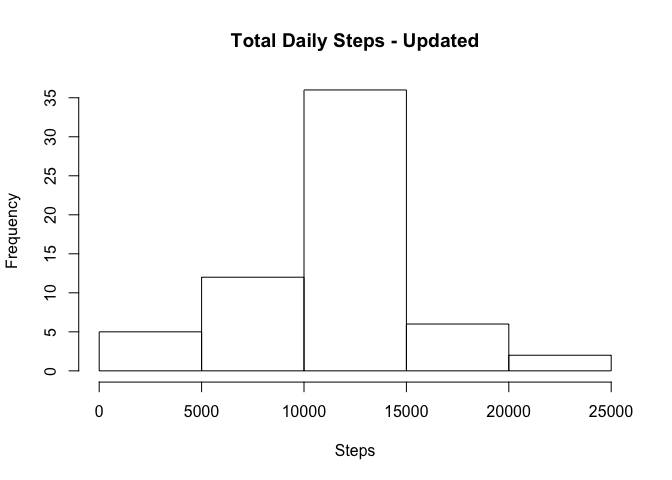

## Loading and preprocessing the data

```r
fileURL <- "https://d396qusza40orc.cloudfront.net/repdata%2Fdata%2Factivity.zip"
download.file(fileURL, destfile="./dataset.zip")
unzip(zipfile="./dataset.zip", exdir="./dataset")

if (!file.exists('./dataset/activity.csv')) {
  unzip('./dataset.zip',overwrite=TRUE)
}
activity <- read.csv("./dataset/activity.csv", header=TRUE)
```

## Histogram of the total number of steps taken each day
#### Calculate total number of steps taken each day
#### Histogram total number of steps taken each day

```r
totalsteps <- aggregate(steps ~ date, activity, FUN=sum)
hist(totalsteps$steps, xlab= "Steps",  main= "Total Daily Steps")
```

<!-- -->

## Mean and median number of steps taken each day

#### Mean number of steps taken each day

```r
meantotalsteps <- mean(totalsteps$steps)
print(meantotalsteps)
```

```
## [1] 10766.19
```

#### Median number of steps taken each day

```r
mediantotalsteps <- median(totalsteps$steps)
print(mediantotalsteps)
```

```
## [1] 10765
```

## Time series plot of the average number of steps taken
#### What is the average daily activity pattern?
#### Time series plot of the 5-minute interval and the average number of steps taken, averaged across all days


```r
averageStepsDaily <- aggregate(steps ~ interval, activity, mean)
ggplot(data = averageStepsDaily, aes(interval, steps)) +
  geom_line() +
  ggtitle("Average Daily Activity Pattern") +
  xlab("5-minute Time Interval") +
  ylab("Average Number of Steps")
```

<!-- -->

#### The 5-minute interval that, on average, contains the maximum number of steps

```r
averageStepsDaily$interval[which.max(averageStepsDaily$steps)]
```

```
## [1] 835
```
The 5-minute time interval that contains the maximum number of steps is 835.

## Imputing missing values

#### Total number of missing values

```r
missingData <- table(is.na(activity) == TRUE)
missingData[[2]]
```

```
## [1] 2304
```

#### Strategy for imputing missing values in dataset
#### New dataset that is equal to the original dataset but with the missing data filled in.

```r
# Replace NA values with mean --> New dataset == "updated_activity"
updated_activity <- activity
updated_activity$steps[is.na(updated_activity$steps)] <- mean(updated_activity$steps, na.rm = T)
```

#### Histogram of the total number of steps taken each day after missing values are impusted

```r
updated_total_steps <- aggregate(steps ~ date, data = updated_activity, sum)
hist(updated_total_steps$steps, main = "Total Daily Steps - Updated", xlab = "Steps")
```

<!-- -->

#### Mean steps after accounting for missing values

```r
mean_updated_total_steps <- mean(updated_total_steps$steps)
print(mean_updated_total_steps)
```

```
## [1] 10766.19
```

#### Median steps after accounting for missing values

```r
median_updated_total_steps <- median(updated_total_steps$steps)
print(median_updated_total_steps)
```

```
## [1] 10766.19
```

The values differ from the estimates earlier. The mean and median are now equal as we have updated the missing values of the total daily number of steps. 

## Panel plot comparing the average number of steps taken per 5-minute interval across weekdays and weekends

#### Are there differences in activity patterns between weekdays and weekends?


```r
#New factor variable of dataset - dayofweek
updated_activity$weekdays <- weekdays(as.Date(updated_activity$date))
updated_activity$weekdays = factor(updated_activity$weekdays)

#Saturday || Sunday is Weekend; Not Saturday || Sunday is Weekday

updated_activity$dayofweek[(updated_activity$weekdays == "Saturday" | updated_activity$weekdays == "Sunday")] <- "weekend"
updated_activity$dayofweek[!(updated_activity$weekdays == "Saturday" | updated_activity$weekdays == "Sunday")] <- "weekdays"
```

#### Panel plot

```r
average_step_weeks <- aggregate(steps ~ interval + dayofweek, data = updated_activity, mean)
xyplot(steps ~ interval | dayofweek, data = average_step_weeks, type = "l", layout = c(1, 2), xlab = "Interval", ylab = "Number of steps", main = "Average Number of Steps Among Weekdays and Weekends")
```

<!-- -->

There are differences in activities between the average number of steps taken in the weekdays and weekends. The number of steps in the weekend occurs throughout the days, as opposed to certain intervals in the weekdays. 
